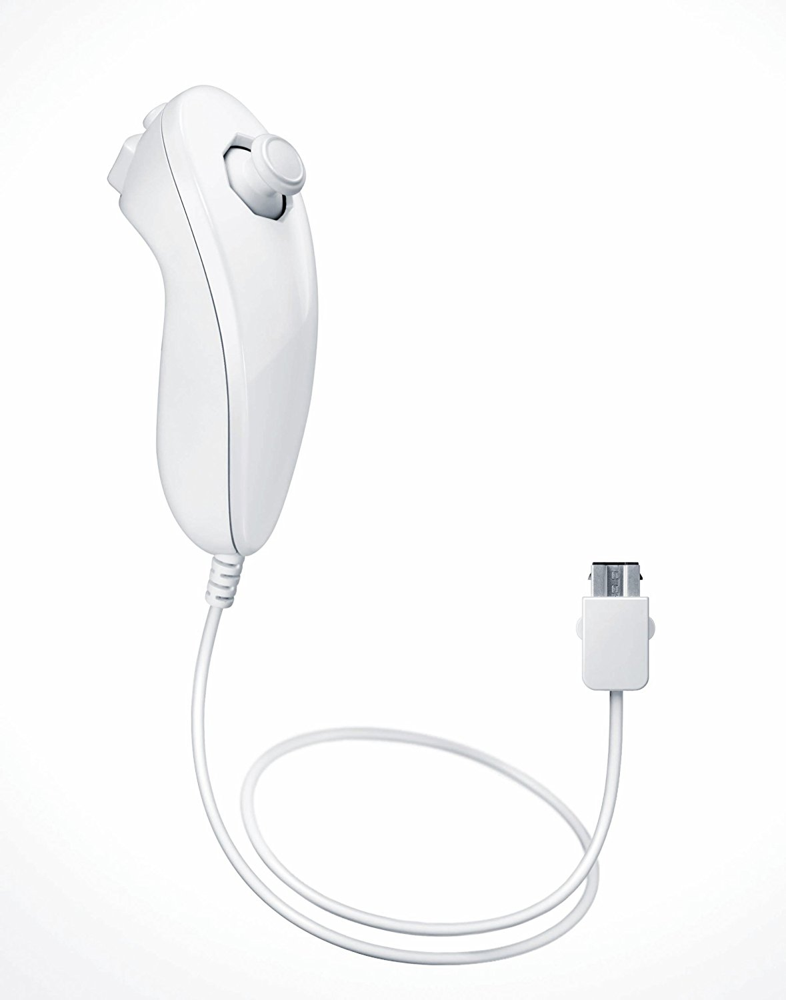
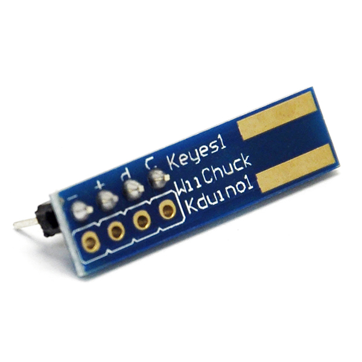
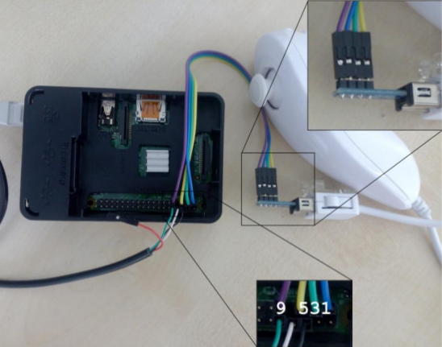
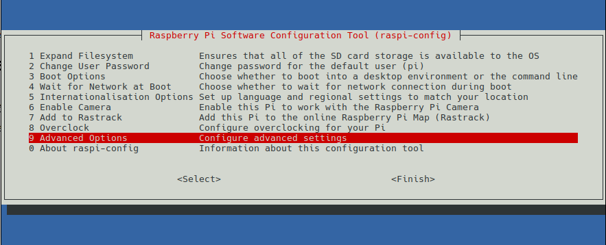
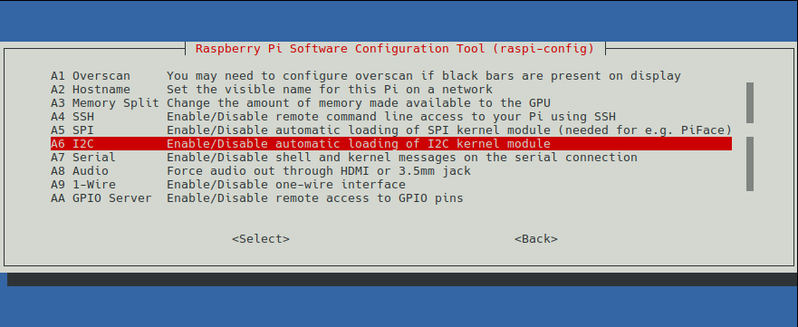
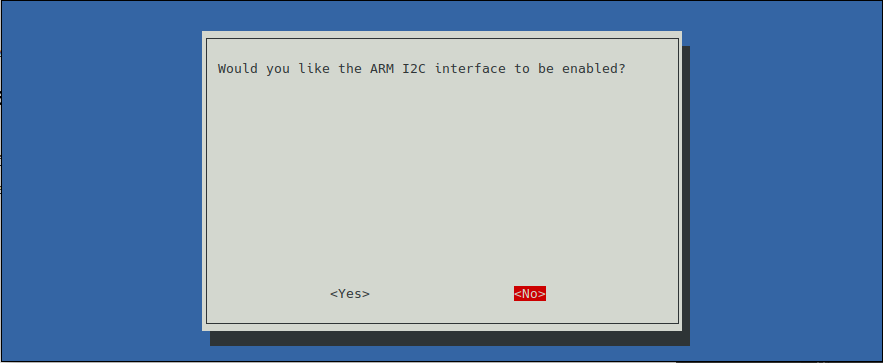

# Nunchuk  I2C drajver za Raspberry Pi
## 0. Autori
[Igor Ilić](http://github.com/dexters1)  
[Kosta Svrdlan](http://github.com/goust6)  
[Mario Perić](http://github.com/randomCharacter)  

## 1.  Uvod
  
### 1.1  Wii Nunchuk

Wii Nunchuk je prvi dodatak za Nintendo Wii kontroler, koji je
premijerno prikazan javnosti 2005. godine. Povezuje se na Wii kontroler
preko specijalnog konektora koji je razvijen od strane Nintenda. Wii
Nunchuk ima analogni džojstik, 2 dugmeta i akcelerometar koji radi na
sve 3 ose. Na početku je Nunchuk pravljen isključivo u beloj boji, dok
su se kasnije pojavile i verzije u drugim bojama. Slika 1 Pokazuje beli
Nunchuk.

Slika 1 - Beli Nunchuk

Wii Nunchuk interno ima 6 registara veličine bajta, u kojima čuva redom:
x koordinatu džojstika, y koordinatu džojstika, x, y i z koordinate
akcelerometra i stanja prekidača.

|**Redni broj registra**|**1**|**2**|**3**|**4**|**5**|**6**|
|----------------|:---:|:---:|:---:|:---:|:---:|:---:|
|**Funkcija**|Džojstik – x koordinata|Džojstik – y koordinata|Akcelerometar – x koordinata|Akcelerometar – y koordinata|Akcelerometar – z koordinata|Ostali biti akcelerometara i tasteri C i Z
Tabela 1 - Nunchuk
registri
#### 1.1.1 Komunikacija sa RPI računarom

Za komunikaciju sa drugim uređajima Nunchuk koristi I2C tehnologiju.
Kako Nunchuk koristi specijalan priključak, nije moguće povezati ga
direktno na Raspberry Pi. U te svrhe koristimo specijalno dizajniran
konektor (Slika 2) koji nam omogućava da Nunchuk spojimo direktno na
slobodne pinove Raspberry Pi-a.

Slika 2 - Keyes1
W11Chuck Kduino1 konektor

#### 1.1.2 I2C

Kako Nunchuk za komunikaciju koristi I2C, potrebno je povezati ga na
određene pinove, koji su zaduženi za ovaj vid komunikacije. U ovom
slučaju to su pinovi GPIO2 i GPIO3 (Slika 3). Primer povezivanja dat je
na slici 4.

Slika 3 - GPIO header

Slika 4 - Primer
povezivanja na Raspberry Pi

### 1.2 Zadatak

Realizovati Linux rukovodilac za Raspberry Pi 2 uređaj. Uredjaj treba da
omogući komunikaciju korisničkog programa i I2C Master periferije
dostupne na uređaju (BSCI kontroler)

U načelu, rukovalac treba da omogući:

-   Inicijalizaciju I2C kontrolera prilikom učitavanja rukovaoca

-   Upis podataka ( datog niza bajtova date dužine ) u I2C uređaj koji
    se nalazi na zadatoj I2C slave adresi. Zahtev za upis dolazi kroz
    odgovarajuću operaciju nad datotekom uređaja

-   Čitanje podataka ( niza bajtova date dužine ) iz I2C uređaja koji
    se nalazi na zadatoj I2C slave adresi. Zahtev za čitanje dolazi
    kroz odgovarajuću operaciju nad datotekom uređaja

## 2. Analiza problema

Glavni problem u izradi zadatka je realizacija I2C protokola. Jedan on
načina da se ovo reši je korišćenjem BC2835 čipa koji se nalazi na
Raspberry Pi uređaju. Ovaj čip služi za I2C komunikaciju. Kako bi se
čip koristio potrebno je poznavati memorijske adrese njegovih registara,
kao i njihovu funkciju. Funkcija i adrese ovih registara mogu se naći u
priloženom dokumentu, a njihova detaljnija funkcija data je u sledećem
poglavlju.

Prilikom transfera podataka potrebno je iz dobijenih registara izvući
potrebne informacije. Ovo ne predstavlja nikakav problem i uz malo
logike nad bitima se može lako realizovati.

Sledeći problem koji se javlja je način komunikacije sistemskih
aplikacija sa datim fajlom. Odlučeno je da se ovaj problem reši tako što
će se za komunikaciju koristiti struktura nunchuk iz testne aplikacije
data u *nunchuk\_test\_app/src/nunchuk.h,* međutim i ostala rešenja mogu
biti podjednako dobra.

Primećeno je da se stanje tastera vraća u obrnutoj logici (logička 0
kada je taster pritisnut, odnosno 1 kada taster nije pritisnut), te je
potrebno invertovati ove bite.

## 3. Koncept rešenja
### 3.1.  BC2835

Kako Raspberry Pi na sebi već sadrži Broadcom BC2835 čip, koji služi za
I2C komunikaciju, nije potrebno implementirati je na potpuno niskom
nivou. Međutim potrebno je poznavati memorijske adrese njegovih
registara i način na koji oni funkcionišu. Za ovaj projekat važni su
sledeći registri datog kontrolera:

-   S – status registar (govori o tome da li je sve prošlo kako treba)

-   C – komunikacioni registar (zadužen za izbor smera komunikacije)

-   FIFO – registar u kojem se nalaze podaci koje treba poslati

-   DLEN – dužina podataka koje treba poslati/primiti

Adrese ovih registara date su u header fajlu.

### 3.2 I2C modul

Kako Raspbian već sam po sebi ima kernel modul koji služi za
komunikaciju sa BC2835 čipom, potrebno je isključiti ga, kako bi naš
drajver mogao da pristupa adresama bez konflikata i eventualne međusobne
ometnje. Ovaj drajver može se isključiti pokretanjem komande „sudo
raspi-config“, nakon čega je potrebno izabrati opciju 9 (*Advanced
options*), a zatim A6 (*I2C*), nakon čega je potrebno izabrati *No* i
restartovati uređaj (Slika ).

Slika 5 - Postupak
isključivanja I2C modula

## 4. Opis rešenja
### 4.1  Kernel modul – osnovne metode
#### 4.1.1 Konstante i adrese

Sve konstante i adrese date su u header fajlu nunchuk.h.

#### 4.1.2 Funkcija za slanje podataka *send\_data(char \*buff, int n)*

Ova funkcija prvo čisti registar S, a C postavlja na potrebne vrednosti
kako bi se moglo započeti slanje, nakon čega se potrebni podaci
prepisuju u FIFO refistar kontrolera, a njihova veličina u DLEN
registar. Nakon toga pisanjem u registar C započinje se transfer
podataka.

#### 4.1.3 Funkcija za primanje podataka *receive\_data(char \*buff, int n)*

Slično prethodnoj funkciji registar S se prvo čisti, nakon čega se u
registar C upisuje konstanta koja govori da se podaci ovog puta čitaju.
U registar DLEN postavlja se očekivana dužina poruke, nakon čega može da
se započne komunikacija. Nakon ovoga potrebno je iz FIFO registra
podatke prebaciti u bafer.

#### 4.1.4 Funkcija za uspostavljanje veze *send\_handshake(void)*

Kako bi se uspostavila veza sa nunchukom potrebno je na slave adresu
nunchuk-a poslati 0xF0 i 0x55 kako bi se prvi registar inicijalizovao, a
nakon toga i 0xFB i 0x00 kako bi se drugi registar inicijalizovao. Ova
funkcija vraća SUCCESS ukoliko je sve prošlo kako treba, odnosno
RET\_ERR ukoliko je došlo do greške pri komunikaciji.

#### 4.1.5 Funkcija za čitanje registara *read\_registers(char \*buff, int n)*

Ova funkcija čita sa adrese 0x00, na kojoj se nalaze svi registri.
Ukoliko se kao n prosledi 6, u bafer će se sekvencijalno smestiti
vrednosti svih registara.

#### 4.1.6 Funckija za inicijalizaciju modula

Ova funkcija se poziva prilikom uvezivanja modula u kernel. U njoj se
registruje novi chardev, nakon čega se pokušava alocirati deo memorije
koji sadrži potrebne adrese za komunikaciju sa BC2835 čipom. Potrebni
pinovi se postavljaju na PullUp, što je po standardu I2C komunikacije.
Pokazivači na registre se podese na odgovarajuće memorijske adrese.
Nakon toga se upišu slave adresa, kao i divizor frekvencije u
odgovarajuće registre. Nakon ovoga poziva se funkcija send\_handshake,
koja služi sa inicijalizaciju perifernog uređaja.

#### 4.1.7 Funkcija za brisanje modula

Ova funkcija se poziva kada se modul uklanja iz kernela. U njoj se
oslobađa memorija koja je prethodno zauzeta, oslobađa se chardev i sa
pinova se ukljanja PullUp veza

#### 4.1.8 Funkcija za otvaranje

Ova funkcija se poziva kada neko pokuša da otvori fajl koji služi za
komunikaciju sa uređajem. Ona proverava da li je datoteka već otvorena i
ukoliko jeste vraća grešku, inače otvara datoteku i to evidentira.

#### 4.1.9 Funkcija za zatvaranje

Ova funkcija oslobađa datoteku.

#### 4.1.10 Funkcija za čitanje

Ova funckija poziva se kada neko pokuša da čita iz prethodno otvorene
datoteke. U njoj se isčita vrednost iz registara nakon čega se oni
smeste u odgovarajuće nizove i vrate i to na sledeći način:

-   Džojstik – 2 bajta (za svaku koordinatu po jedna)

-   Akceleromerat – 3 šorta (za svaku koordinatu po jedan (10 bita))

-   Statusi dugmadi C i Z (po bajt za svaki)

#### 4.1.11 Ostale funkcije

Ostale funkcije preuzete su sa primera iz vežbi 6 i 7 i uglavnom služe
za postavljanje stanja pinova na Raspberry Pi ploči.

## 4.2 Aplikacija za testiranje modula
### 4.2.1 Status

Aplikacija status predstavlja prostu aplikaciju koja otvara prethodno
registrovani chardev **/dev/nunchuk** nakon čega čita iz njega i
rezultat ispisuje na ekran, sve dok je korisnik ne prekine.

### 4.2.2 2048

Ova aplikacija predstavlja port igrice [2048](https://github.com/mevdschee/2048.c) koju je napisao Maurits van
der Schee, a koja se izvršava u terminalu.

## 5. Zaključak

Zadatak projekta je realizacija Linux rukovodilac za Raspberry Pi 2
uređaj. Rukovodilac treba da omogući komunikaciju korisničkog programa i
I2C Master periferije dostupne na uređaju (BSCI kontroler). Jedno od
mogućih rešenja datog problema je ukratko predstavljeno u predhodnim
poglavljima. Kako bi demonstrilali funkcionalnost naseg rešenja
napravljena je aplikacija koja ispisuje trenutna stanja registra urađaja
na standardni izlaz. Radi korisnije ilustracije odrađena je funkcija
koja omogućava korišćenje Nintendo Wii Nunchuk uređaja kao ulaznog
interfejsa za igranje igrice “2048“. U ovoj igrici postoje četiri
komande: gore, dole, levo i desno. Komande se unose preko džojstika,
kako se pamte x i y kordinate trenutne lokacije glave džojstika potrebno
ih je pretvoriti u neku od mogučih komandi. To se ostvaruje jednostavnim
uslovima koji proveravaju dal se kordinata date ose nalazi u najvišh
deset ili najnižih deset mogućih vrednosti kordinate, na osnovu toga se
zaključuje koji smer je aktivan.
